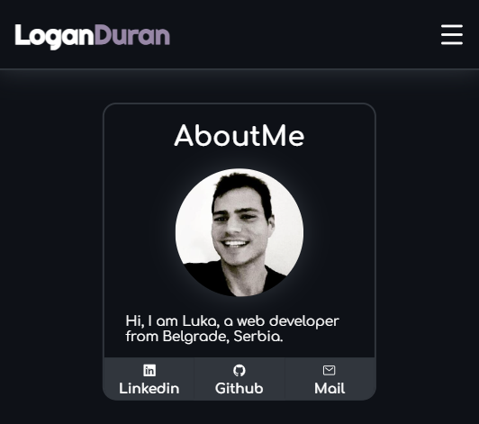
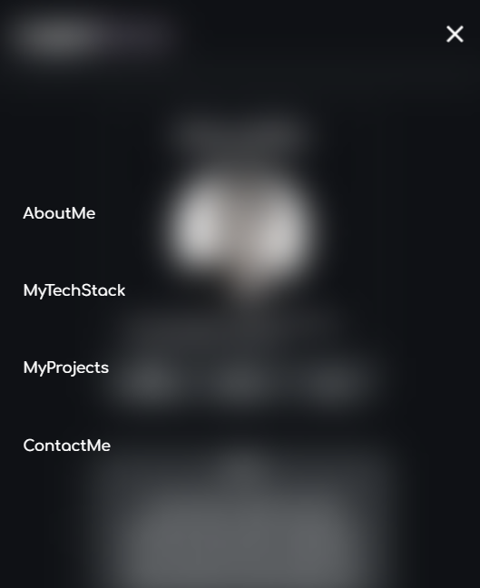
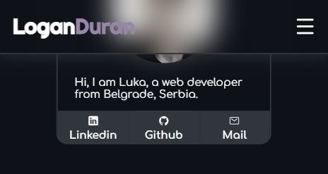

# MyUniversalHeader - [Preview](https://loganduran.github.io/MyUniversalHeader/index.html)

Fully responsive universal header with a transparent background effect.

I made this for my portfolio website and plan to use it on all my personal projects.

this is what the Blur effect looks like when the drop-down menu is open

also the Header itself is transparent and it gives this effect when it goes over the content